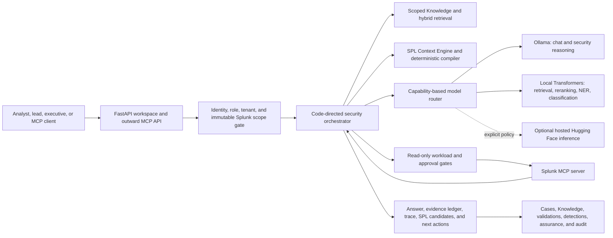

# SignalRoom customer brief

> **Purpose:** A shareable introduction to SignalRoom for customers, partners, architects, and development teams.
> This document describes the repository as of September 8, 2026. SignalRoom is currently a technical preview;
> production acceptance remains deployment specific.

## The one-minute explanation

SignalRoom is a local-first, evidence-led security operations workspace built around Splunk. It helps an analyst
understand an unfamiliar Splunk estate, ask security questions in natural language, create context-grounded SPL,
validate that SPL through explicit gates, preserve findings in cases, and turn proven evidence into detection work.

It is not simply a chatbot placed in front of a SIEM. SignalRoom is the orchestration and trust layer between a
person, local or optional hosted AI models, reusable organizational knowledge, and a permissioned Splunk MCP
server. Application code—not the language model—selects tools, enforces scope, compiles trusted SPL, controls
workload, and records provenance. Models never receive Splunk credentials.

The result is an environment where AI can help with interpretation and prioritization without becoming an
unbounded execution authority.

## Why it exists

Security teams usually do not lack data. They lack inexpensive, repeatable ways to turn data into trustworthy
context and carry that context through an investigation.

SignalRoom addresses five recurring problems:

1. **The SIEM is difficult to learn.** Discovery maps indexes, sourcetypes, fields, knowledge objects, telemetry
   freshness, detection health, and data-model readiness into reusable local context.
2. **The same questions cause the same searches.** Tenant- and revision-scoped Knowledge retrieval reuses prior
   discovery and curated artifacts before spending another Splunk query.
3. **Generated SPL is too easy to trust prematurely.** A local model proposes typed intent; deterministic code
   resolves it against the observed schema and compiles bounded SPL. Review, parser checks, approval, workload
   admission, execution, and result-shape validation remain separate stages.
4. **AI answers often lose their evidence.** Responses include source references, an evidence ledger, model/tool
   trace, uncertainty, and follow-on actions. Material work can be promoted into a durable case or detection.
5. **Useful prototypes become ungovernable platforms.** Optional RBAC, immutable connection identities, model
   artifact approval, evaluation gates, audit history, recovery, and release checks provide a path from one-user
   proof of concept to a controlled team deployment.

## What a user experiences

SignalRoom opens in a guided, outcome-focused view. The complete capability set remains available through
**Show all tools**, but a new user can begin without understanding MCP, retrieval, model routing, or the storage
architecture.

| Workspace | Immediate user value | What makes it trustworthy |
| --- | --- | --- |
| **Investigate** | Ask a security question, inspect live or retained evidence, and receive next actions | Exact Splunk scope, bounded tool planning, evidence references, and visible execution trace |
| **Discovery** | Learn what the estate contains, what telemetry is fresh, and where coverage is weak | Read-only depth profiles, call ceilings, durable progress, change detection, and reusable artifacts |
| **Cases** | Preserve ownership, evidence, hypotheses, decisions, and shift handoffs | Tenant-scoped timeline, evidence-health cockpit, and source provenance |
| **Detections** | Turn validated observations into reviewed, versioned detection content | Exact evidence lineage, SPL validation state, signed versions, and disabled-by-default deployment packages |
| **Knowledge** | Curate runbooks, intelligence, references, discovery output, and known-good SPL | Stable artifact references, scoped hybrid retrieval, update/delete controls, and source attribution |
| **Models** | See whether AI capabilities are available, trusted, current, and improving | Task-specific profiles, local-first execution, adaptive installation, exact artifact approval, evaluation, promotion, and rollback |

### Value by role

- **Analyst or security engineer:** faster orientation, fewer duplicate searches, safer SPL drafts, better pivots,
  and evidence that can survive beyond the chat window.
- **Detection engineer:** observed schema and validation evidence become versioned detection work instead of a
  copied query with unknown provenance.
- **Incident or SOC lead:** cases expose evidence health, unresolved hypotheses, ownership, and the next best
  decision across shifts.
- **CISO or executive:** the same underlying evidence can be rendered as material risk, confidence, coverage,
  ownership, and decisions rather than a raw telemetry inventory.
- **Platform owner:** model, query, connection, access, audit, recovery, and release controls are visible instead
  of hidden inside prompt text.

## A useful customer walkthrough

A focused demonstration can tell the full story in roughly fifteen minutes:

1. **Select the Splunk scope.** Show that every investigation is attached to one tenant and immutable connection
   revision. Use opt-in demo mode when live infrastructure is not appropriate.
2. **Run Standard Discovery.** Let the progress stream show the actual phases. Review one telemetry or detection
   finding and explain why it was created.
3. **Open the finding in Investigate.** Ask SignalRoom to explain impact, uncertainty, and the safest validation
   step. Inspect the evidence ledger and tool/model trace.
4. **Ask for SPL.** Show the schema-grounded trust receipt and the multi-block chooser when several searches are
   proposed. **Try this SPL in Splunk** creates a validation draft; it does not silently execute.
5. **Approve a bounded validation.** Where advertised, show native Splunk parser evidence and optional Splunk AI
   Assistant critique. Then run through the explicit workload-controlled execution gate.
6. **Preserve the outcome.** Add the observation or hypothesis to a case and show how validated evidence can
   begin a detection-as-code project.
7. **Open Models.** Explain local Ollama reasoning, local SecureBERT retrieval/NER/reranking, optional hosted
   inference, exact artifact trust, and evidence-based promotion.

The important demonstration outcome is not “the model answered a question.” It is “the platform produced a
scoped, inspectable chain from question to evidence to validation to durable action.”

## How the platform works

### Prompt-to-output orchestration

1. The browser submits the prompt, investigation mode, context/search permissions, and selected immutable scope.
2. SignalRoom verifies authorization and connection identity before any model or MCP call.
3. A deterministic router classifies the task. Relevant Knowledge is retrieved through SQLite FTS5, optional
   SecureBERT embeddings, and optional cross-encoder reranking.
4. For live-data questions, a bounded planner selects from recognized read-only Splunk MCP capabilities. It is not
   an open-ended ReAct loop.
5. Workload controls evaluate read-only safety, concurrency, risk, relative cost, and configured budgets.
6. Narrow factual results can be rendered directly. Analytical tasks receive a bounded, evidence-labeled model
   prompt through the selected capability profile.
7. The response returns as a structured envelope containing answer text, evidence, provenance, trace, ledger,
   entities, SPL candidates, and useful follow-on actions.

For a concise engineering-level explanation, see
[How SignalRoom model orchestration works](MODEL_ORCHESTRATION_TLDR.md).

## Trusted SPL without a dedicated SPL model

SignalRoom treats SPL generation as a compiler problem supported by a model, not as unconstrained text generation.

The latest discovery blueprint for the exact active Splunk revision supplies a local schema graph of indexes,
sourcetypes, fields, field types, and relevant knowledge relationships. Pasted event-shaped examples are converted
into synthetic shapes: useful names and types can remain, while source values, `_raw`, evidence excerpts, and live
result values are excluded from the authoring packet.

A local model returns one to four typed search intents under a strict schema. Deterministic code then:

- resolves identifiers against the complete observed catalog;
- withholds unknown indexes, sourcetypes, or fields rather than guessing;
- emits only allowlisted event, count, aggregate, or timechart forms;
- applies explicit relative time bounds and row limits; and
- attaches a receipt describing source context, exposure boundary, completed checks, expected result shape, and
  validation still required.

Where the selected Splunk MCP connection advertises a native parser or Splunk AI Assistant capability, SignalRoom
can use it as an additional validation or critique stage. It never assumes those tools exist on every instance.
The final authority remains Splunk permissions plus deliberate bounded execution—not model confidence.

## Local-first model strategy

SignalRoom exposes models as capabilities rather than presenting one undifferentiated model dropdown.

| Capability | Default execution path | Purpose |
| --- | --- | --- |
| General orchestration and synthesis | Ollama | Tool selection, ordinary analysis, and plain-language answers |
| Security reasoning | Foundation-Sec through Ollama | Triage, hypotheses, TTPs, risk discussion, and security-focused synthesis |
| Cybersecurity retrieval | SecureBERT bi-encoder through local Transformers | Semantic matching over reusable Knowledge |
| Evidence reranking | SecureBERT cross-encoder through local Transformers | Reorder retrieved evidence by security relevance |
| Entity extraction | SecureBERT NER plus deterministic extraction | Candidate indicators, products, vulnerabilities, identities, and pivots |
| Code vulnerability screen | Explicit local-only SecureBERT workflow | Assistive prioritization for deliberately supplied C, C++, or Python snippets |
| Time-series forecasting | Isolated Cisco TSM service | Bounded advisory forecasting with backtesting and promotion gates |

The normal posture keeps generative and specialist inference local. Hugging Face remains useful as a reviewed model
source and can be selected for hosted inference only through explicit disabled/ask/allow policy. The setup flow
checks architecture, Apple MPS availability, runtime dependencies, public-source reachability, storage, artifact
state, and prior attempts. Failures produce model-specific next actions rather than a generic installation error.

Installation is not trust. Exact local artifacts can be approved, evaluated against golden investigations, compared
in a model tournament, promoted deliberately, and rolled back. Publisher freshness is reported separately from
runtime availability and local approval.

## Connections, evidence, and durable scope

SignalRoom is an MCP client of Splunk and also exposes controlled workflows as an MCP server. This allows an agent
host to use domain-specific SignalRoom functions without receiving raw Splunk credentials.

Multiple Splunk estates are supported through stable aliases. Each saved revision fingerprints endpoint, demo/live
mode, TLS contract, and tenant scope while excluding credentials. A changed certificate policy, endpoint, scope, or
token lifecycle requires fresh diagnostics and admission; durable work does not silently follow the alias to a new
target.

The selected scope is applied to Knowledge, retrieval, discovery, investigation memory, cases, validations,
detections, forecasts, assurance responses, deliveries, and outward MCP tools. Cross-estate comparison uses exact
retained snapshots and keeps each side's findings separate rather than creating an ambiguous merged fact store.

The architecture is prepared for additional MCP connections when they further SignalRoom's mission—for example,
read-only CMDB, identity, threat-intelligence, or cloud context, followed by deliberately approved handoff to case
management or detection repositories. These additional connector types are extension targets, not claims of
shipped integrations. Every future connector must declare identity, tenant, least-privilege authority, evidence
attribution, health/version behavior, and a separate write boundary.

## Security and deployment posture

SignalRoom is easy to start, but “easy to install” is not presented as “production approved.”

### Shipped controls

- Loopback-first installation with opt-in synthetic demo mode.
- Per-connection TLS verification toggle and optional private CA bundle for internally managed certificates.
- Encrypted Splunk and Hugging Face tokens at rest; credentials never enter model prompts.
- Optional local RBAC with viewer, analyst, and admin roles plus independent Splunk-alias grants.
- Optional enterprise OIDC with PKCE, exact issuer/audience checks, signed claims, MFA evidence, and group mapping.
- Read-only SPL screening, explicit validation/approval, shared query admission, and per-instance workload policy.
- Tenant- and immutable-revision-bound durable work with fail-closed drift detection.
- Local hash-chained audit records, optional reviewed Splunk HEC export, encrypted control-plane recovery, and
  source-bound upgrade/release checks.
- Local-first model execution, explicit hosted-inference policy, redacted setup diagnostics, exact artifact
  approval, and model evaluation/promotion gates.

### Deployment-owned acceptance

Before non-loopback or production use, the deploying organization must provide controls that source code cannot
prove by itself:

- a least-privilege Splunk service role, authoritative Splunk quotas, and instance-specific MCP acceptance;
- trusted HTTPS ingress, proxy-header and secure-cookie validation, and named access;
- a deployment threat model, secrets/key custody, monitoring, backup ownership, and recovery objectives;
- an off-host restore rehearsal and adversarial tests for outages, certificate rotation, token rotation, and
  tenant/authorization denial paths; and
- human review of model licensing, provenance, evaluation suitability, and operational recommendations.

SignalRoom's guardrails do not replace Splunk authorization, a production identity provider, host hardening, or
professional security judgment. For the complete boundary, read [Security posture](SECURITY.md) and
[Release-candidate acceptance](RELEASE_CANDIDATE.md).

## The art of the possible for a development team

SignalRoom's reusable value is the pattern around the models, not one fixed set of pages. A team can retain the
trust architecture while replacing the domain-specific capability packs.

| Extension seam | What can be changed | Invariant worth preserving |
| --- | --- | --- |
| **MCP adapter** | Add another SIEM, EDR, identity, cloud, asset, or intelligence service | Stable connection identity, least privilege, tenant scope, attributed evidence, and separate write approval |
| **Discovery pipeline** | Replace Splunk catalog phases with domain-specific inventory, posture, or control checks | Bounded read-only calls, retained progress, change detection, deterministic reconciliation, and reusable artifacts |
| **Context graph/compiler** | Compile another trusted query or policy language from typed model intent | Models propose structure; code validates observed identifiers and emits the authoritative artifact |
| **Knowledge/RAG** | Index new runbooks, control catalogs, architecture references, or approved internal guidance | Source attribution, scoped retrieval, stable references, untrusted-content framing, and graceful deterministic fallback |
| **Model capability registry** | Add local or hosted specialists for classification, extraction, forecasting, or reasoning | Task-specific input/output contract, explicit data boundary, immutable revision, evaluation, promotion, and rollback |
| **Durable workflow engine** | Create review queues, readiness checks, response packages, or approval chains for another domain | Restart behavior, immutable target binding, visible state transitions, budgets, and human authority for consequential steps |
| **Cases and evidence ledger** | Reframe cases for operations, compliance, fraud, reliability, or audit work | Observations remain separate from hypotheses; sources, uncertainty, ownership, decisions, and chronology survive handoff |
| **Delivery/repository boundary** | Add a ticketing, SOAR, Git, webhook, or reporting destination | Redaction preview, destination identity, hash-bound approval, idempotency/reconciliation strategy, and local audit first |
| **Guided interface** | Tailor role language, prompt trees, outcome cards, and executive summaries | Progressive disclosure changes presentation only; it never weakens authorization or execution policy |

### Plausible product directions

These are examples of repurposing, not features claimed by the current build:

- **SOC or MSSP workbench:** separate customer estates, shared control-plane policy, tenant-bound evidence, and
  source-preserving comparisons.
- **Detection factory:** combine observed schemas, known-good SPL, validation evidence, Git review, and promotion
  into a repeatable detection lifecycle.
- **Cloud or identity investigation room:** replace the Splunk inventory pack with read-only cloud/identity MCP
  tools while keeping the evidence ledger, cases, workload limits, and scoped retrieval.
- **Operational resilience assistant:** adapt discovery to service topology and telemetry health, then use the
  durable validation and case machinery for incident decisions and post-event learning.
- **Compliance evidence workspace:** map controls to attributed artifacts, surface evidence gaps, and require
  reviewed collection and handoff rather than accepting generated compliance claims.
- **Vertical expert platform:** provide a local general model plus small, task-specific domain models and a
  deterministic compiler for the customer's authoritative language or configuration format.

The core implementation is intentionally modular: the browser/API composition lives in `app.py` and `static/`;
agent orchestration in `agents/`; Splunk context, validation, guardrails, and MCP transport in `splunk/`; discovery
in `discovery/`; capability providers in `providers/`; durable domain services in their named packages; and shared
contracts in `schemas.py`. The project is MIT licensed, while connected products, data, and model artifacts retain
their own terms and review requirements.

## Adoption path

| Stage | Recommended posture | Exit evidence |
| --- | --- | --- |
| **Explore** | Loopback, demo mode or a narrow test Splunk role, local models, RBAC off | Team understands the workflow and identifies a valuable question set |
| **Prove** | One live Splunk instance, Standard Discovery, curated Knowledge, bounded validations | Useful findings, reduced repeat searches, and reproducible evidence chains |
| **Pilot** | Named access, per-user connection grants, model artifact approval, workload policy, cases | Role and denial tests, accepted model baselines, operating ownership, and recovery plan |
| **Govern** | Trusted HTTPS ingress, enterprise identity, audit export, backup/restore rehearsal | Deployment-specific threat model and operational acceptance evidence |
| **Extend** | New connector or capability pack behind the same contracts | Tests for identity, scope, data exposure, failure behavior, evaluation, and promotion |

## Questions worth asking with a customer

- Which security questions consume the most analyst time today?
- Which searches are repeatedly rebuilt because organizational context is not retained?
- Which Splunk instances and tenant boundaries must never be blended?
- What evidence would make an AI-assisted answer defensible to an incident lead or auditor?
- Which actions must remain read-only, which may create drafts, and which require explicit approval?
- Which local models are operationally supportable, and what data may ever leave the host?
- What existing runbooks, detection repositories, asset sources, and case systems should become corroborating
  context or governed destinations?
- What would constitute a measurable pilot win: time to orientation, searches avoided, validation success,
  evidence reuse, detection lead time, or handoff quality?

Those questions turn a generic AI demonstration into a design conversation about decision quality, evidence,
authority, and reuse—the parts of the platform that transfer to many domains.

## Learn more

- [User guide](USER_GUIDE.md)
- [Model orchestration TL;DR](MODEL_ORCHESTRATION_TLDR.md)
- [Architecture](ARCHITECTURE.md)
- [Connection identities and additional MCPs](CONNECTIONS.md)
- [Cisco and Splunk model catalog](MODEL_CATALOG.md)
- [Deployment and lifecycle](DEPLOYMENT.md)
- [Security posture](SECURITY.md)
- [Operational acceptance](OPERATIONAL_ACCEPTANCE.md)
- [Release-candidate acceptance](RELEASE_CANDIDATE.md)
